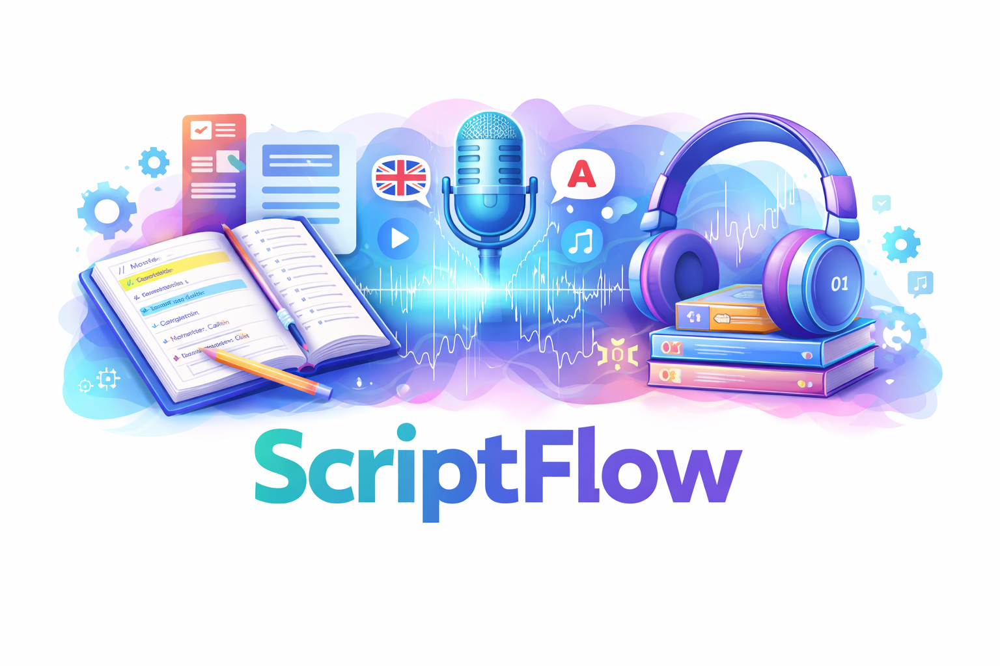

<p align="center">
  
</p>

<h1 align="center">🎧 ScriptFlow</h1>
<p align="center"><i>The script langugae for audio narrations</i></p>

**ScriptFlow** is a lightweight scripting language and toolchain for generating audiobooks from plain text.

It allows you to write structured text and control narration dynamically — including voice, speed, language, and audio generation — all within a single document.

---

## ✨ Why ScriptFlow?

Most audiobook tools focus on **converting text to speech**.

ScriptFlow goes further.

It introduces a **domain-specific language (DSL)** that lets you:

* Structure your book (chapters, sections, subsections)
* Control narration (voice, speed, tone)
* Switch languages dynamically
* Insert pauses and emphasis
* Generate production-ready audio files
* Build audiobooks through a **programmable pipeline**

👉 It’s not just text-to-speech.
👉 It’s **narration as code**.

---

## 🚀 Key Features

* 📘 **Structured Text**

  * `# ` → Chapters
  * `## ` → Sections
  * `### ` → Subsections

* 🎭 **Dynamic Narration**

  * Change voice, speed, and tone mid-text
  * Use high-level *modes* like `Calm`, `Intense`, `Reflective`

* 🌍 **Multi-language Support**

  * Switch language context inline

* ⏸ **Pause Control**

  * Insert precise pauses using comments

* ⚙️ **Execution Control**

  * Jump to parts of the document dynamically

* 🎧 **Audio Pipeline**

  * Chunk generation
  * Temporary audio parts
  * Final merge into chapter files

* 🎯 **ACX-Compatible Output**

  * Generate audiobook files ready for Audible submission

---

## 🧾 Example

```text
// Here starts the Chapter 1
# The Day Everything Worked

// Mode: Neutral
It was a normal morning.

// Pause: 2000
Something felt different.

// Here a section of Chapter 1
## The Twist
// Mode: Intense

Then everything started moving fast.

# Epilogue

Everyone lived happily ever after
```

👉 This produces:

* structured narration
* a pause before the second sentence
* a faster, more intense tone at the end

---

## 🆚 How is this different?

### Traditional tools:

* Convert text → audio
* Limited control
* External configuration

### ScriptFlow:

* Text **is** the configuration
* Full control inside the document
* Supports:

  * structure
  * narration
  * execution
  * audio generation

👉 Everything happens in one place.

---

## 🛠 How It Works

1. Write your document using ScriptFlow syntax
2. Run the parser:

```bash
ScriptFlow.sh yourFile.txt [--start <number|"text">]
```

3. The system will:

   * parse the structure
   * apply parameters
   * generate audio chunks into an output directory (Parameter OutputDir)
   * merge them into final chapter files

NOTE: if you need to pause before the merging,
just set the parameter SkipMerging to true.
All audio chunks will be left in the output directory.
To juse execute the merging run:

```bash
ScriptFlow.sh [--audioFormat acx] --doMerge [outputDir]
```

With this setep you might add/insert or substitue audio
chunks that will be then merged into the chapter files

HELPER: if you want to list all available voices, just run:

```bash
ScriptFlow.sh --listVoices
```

---

## 🧪 Example Use Cases

* Audiobooks
* Multilingual learning material
* Narrated documentation
* Storytelling with multiple voices
* Experimental narration pipelines

---

## 🧠 Design Philosophy

ScriptFlow is built around a few core ideas:

* **Plain text first**
* **Minimal syntax**
* **Local control**
* **Sequential execution**
* **Composable features**

---

## 📚 Documentation (see "tutorial" directory)

The project includes several short documents:

* Basic Example
* Multi-language Example
* Mode / Rate Example
* Audio Generation
* Testing & Debugging
* Cookbook (common patterns)
* Language Specification

---

## 🔧 Requirements

* macOS (uses `say` for speech synthesis)
* Node.js
* ffmpeg (for audio merging)

---

## 🚧 Future Ideas

* Character voices
* Emotion-driven narration
* GUI editor
* Real-time preview
* Cloud TTS integration

---

## 🤝 Contributing

Contributions and ideas are welcome.

This project is evolving into a full **narration scripting system**, and feedback is highly appreciated.

---

## 📜 License

MIT License (or choose your preferred one)

---

## ⭐ Final Thought

ScriptFlow turns a document into:

> a script, a narration, and an audiobook — all at once.
